## 2. 本日のOpenShiftワークショップ本編
### 概要
OpenShift Container Platform のコマンドラインインターフェース (CLI) を使用し、ターミナルからアプリケーションを作成し、IBM Cloud 上の OpenShift にデプロイします。</br>
このCLIを使ったプロジェクト管理方法は以下の場合に適しています。

<kdb></kdb>

### 2.0. OCコマンド実行環境準備

1. お使いのPC環境に合ったOCコマンドの実行プログラムを以下の手順でダウンロードしてください。</br>
OpenShiftのメニューバーに並んでいる「？」アイコンをクリックし、プルダウンされるものの中から「Command Line Tools」をクリック</br>

<kdb></kdb>
  
ここの各OS用OCコマンドの実行プログラムをクリックし、ダウンロード</br>

<kdb>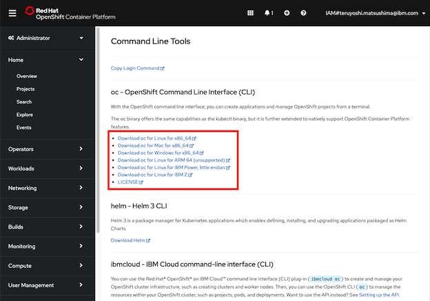</kdb>

・ Mac/Linuxの場合</br>
「$PATH」が示す場所にダウンロードした「oc.zip」を解凍</br>
この場合、環境変数PATHが「/usr/local/bin」に通っているので、そのディレクトリ配下に以下のコマンドを使って解凍</br>
`unzip ~/Downloads/oc.zip -d /usr/local/bin/`
また、動作確認のため`oc`コマンドを実行してみる

<kdb></kdb>

すると、以下のような発行元不正のため実行できない旨が表示されるので、ここでは一旦「キャンセル」してください。

<kdb></kdb>

このOCコマンドの実行を許可するために、以下の手順でシステム環境設定でOCコマンドを許可します。</br>
まず、[リンゴマーク]-[システム環境設定]</br>

<kdb></kdb>

[セキュリティとプライバシー]</br>

<kdb>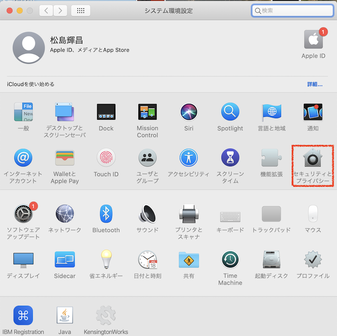</kdb>

画面左下にある閉じた鍵アイコンをクリックし、認証</br>

<kdb>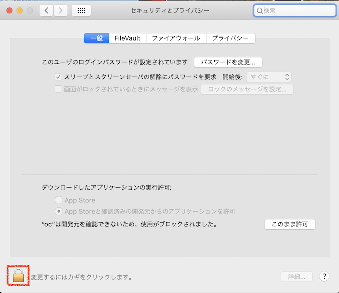</kdb>

<kdb></kdb>

画面左下にある鍵アイコンが開いたアイコンになったことを確認し、「”oc”は開発元を確認できないため、使用がブロックされました。」の右にある「このまま許可」をクリック</br>

<kdb>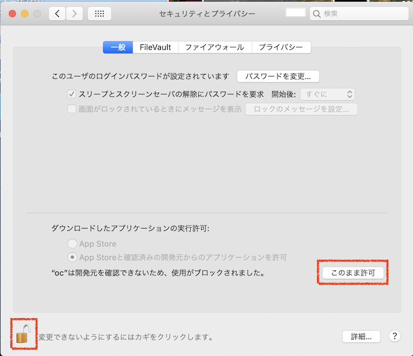</kdb>

ocコマンド実行1回目は、発行元不明のコマンド実行に対し注意喚起ダイアログが表示されますが、IBMからダウンロードしたocコマンドですので「開く」をクリック</br>

<kdb>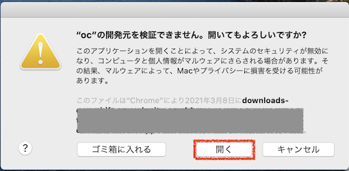</kdb>

再度、ocコマンドの実行を確認</br>

<kdb></kdb>


・ Windowsの場合</br>
ダウンロードされた「oc.zip」を右クリックし、「すべて展開」により任意のディレクトに解凍</br>
解凍先を「環境設定変数」として使うためパスをコピーしておく</br>

<kdb></kdb>

<kdb>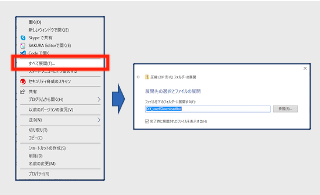</kdb>


[スタート]右クリック-[システム]-[システムの詳細設定]をクリック

<kdb>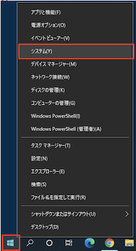</kdb>

<kdb>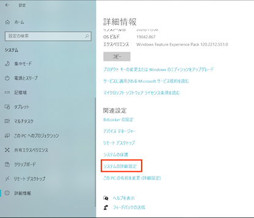</kdb>


[システムのプロパティ]ダイアログ-[環境変数]をクリック

<kdb></kdb>

[環境変数]ダイアログ上で、「Path」をクリックし、[編集]で[新規]を選択し、さきほど控えたOCコマンドのパスを記入</br>

<kdb></kdb>

再度、ocコマンドの実行を確認</br>

<kdb></kdb>

2. お使いのPC環境から IBM Cloud 上の OpenShift 環境にログインします。
ご自身のIAMをプルダウンし、プルダウンされるものの中から「Copy Login Command」をクリック</br>
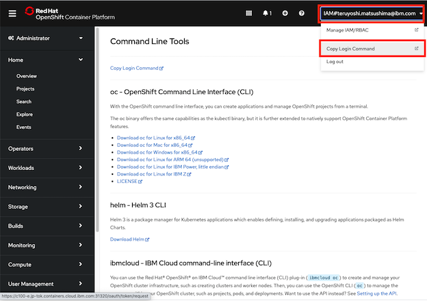

「Display Token」をクリック</br>


「Log in with this token」枠に記載されているOCコマンドをコピー</br>


ご自身のターミナルにペースト＆実行</br>
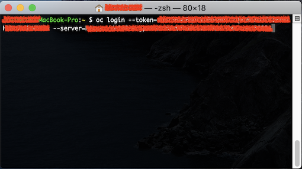

ログイン成功</br>
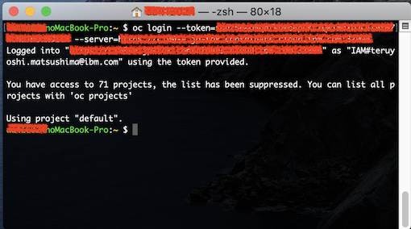


### 2.1. プロジェクト  クローン
ワークショッププロジェクト用にお好みのディレクトリ/フォルダを作り、そこに移動してください。
まずこのハンズオンでオマージュするプロジェクト [https://github.com/osonoi/node-build-config-openshift](https://github.com/osonoi/node-build-config-openshift)をクローンします。<br>

```
git clone https://github.com/IBM/node-build-config-openshift
cd node-build-config-openshift
```

今クローンしたディレクトリにある**Dockerfile**を見れば、これから作成しようとしているアプリがどのようにコンテナライズされているのか分かります。<br>

```
cat Dockerfile
```

**Dockerfile**内の中身です。

```
# Use the official Node 10 image
FROM node:10

# Change directory to /usr/src/app
WORKDIR /usr/src/app

# Copy the application source code
COPY . .

# Change directory to site/
WORKDIR site/

# Install dependencies
RUN npm install

# Allow traffic on port 8080
EXPOSE 8080

# Start the application
CMD [ "npm", "start" ]
```

### 2.2. イメージ ビルド
**oc new-build**コマンドでカスタムビルダーイメージをビルドする BuildConfig を定義します。

```
oc new-build --strategy docker --binary --docker-image node:10 --name example-health
```

少し時間がかかりますが、最後に**--> Success**と表示されると成功です。

次に、先の手順で作成された**BuildConfig**を指定して、**oc start-build**によりイメージを構築します。

```
oc start-build example-health --from-dir . --follow
```

こちらも少し時間がかかりますが、イメージがdocker-registryにアップロード完了すれば成功です。<br>

### 2.3 デプロイ
先の手順でビルド＆docker-registryへのアップロード完了しました。</br>
次は、docker-registryからアプリをOpenShift上にデプロイします。

```
oc new-app -i example-health
```

OpenShiftの上にアプリはデプロイできました。<br>

### 2.4 アプリ公開
先の手順で、OpenShift上でアプリは動き出しましたが、まだこのアプリはインターネット環境への接続口を開けていないため、私達はインターネットを介してアクセスすることはできません。<br>
そのため、次のコマンドでこのアプリに外部環境との接続口を構築します。

```
oc expose svc/example-health
```

### 2.5 アクセスURL
先の手順で**example-health**に外部からアクセスすることができるようになりました。<br>
ですが、アクセスURLは分かりませんよね？<br>
そこで、次のコマンドを使ってアクセスURLを調べてください。

```
oc get routes
```

おそらく以下のような出力になるのではないでしょうか？
```
$ oc get routes

NAME             HOST/PORT                                                                                                                        PATH      SERVICES         PORT       TERMINATION   WILDCARD
example-health   example-health-example-health-ns.aida-dev-apps-10-30-f2c6cdc6801be85fd188b09d006f13e3-0001.us-south.containers.appdomain.cloud             example-health   8080-tcp                 None
```

上記の中で**example-health-example-health-ns.aida-dev-apps-10-30-f2c6cdc6801be85fd188b09d006f13e3-0001.us-south.containers.appdomain.cloud**の部分がアクセスURLになります。<br>
ご自身の環境からこのURLにアクセスしてみてください。

### 2.6 アプリケーションへのアクセス
デプロイされ、Webへ公開されたアプリケーションへアクセスできました。<br>
実際にこのアプリケーションへログインしてみましょう。ID,Passwordともに「test」と入れてログインしてください。<br>
医療関連のデータを管理するサンプルアプリケーションへログインできたかと思います。


お疲れ様でした。ここまでで、GitHub上のソースコードをCLIを使ってOpenShiftへデプロイする方法を学びました。


## その他のアプリケーション
もし、PHPのサンプルアプリケーションで試してみたい方は下記のリポジトリーのソースコードを試してみてください。
[https://github.com/osonoi/php-s2i-openshift](https://github.com/osonoi/php-s2i-openshift)
